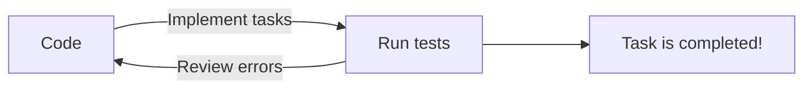

# Tasks

Here you can train your programming skills and test your solutions by passing tests. You can copy this repository and open a project with tasks that you need to implement. After you finish you have to run unit tests and check your solution. **Have a hice coding!**


## How to do tasks

In each folder you can find tasks wth projects. Open a project and find file without implemention.
> For example: Open project in [.NET/Task001_DotNetStart/Task001_DotNetStart.sln](https://github.com/DmytroITStepLearn/Tasks/tree/main/.NET/Task001_DotNetStart) and navigate to file **Algorithms.cs**

Find methods that should be implemented and write code

```C#
// Tip: use Console.ReadLine and Console.WriteLine
/// <summary>
/// This method reads four numbers from Console and adds then together and write to Console
/// Example: 
/// input: 1
///        2
///        3
///        4
/// output: 1234
/// </summary>
public void AddNumbersTogether()
{
    throw new NotImplementedException();
}
```
> Write your code instead of **throw new NotImplementedException();**

Read comments above methods and then implement the methods. 

## How to test your code
After you're finished you have to open **Test Explorer**. 

|Visual Studio|JetBrains Rider|
|-------------|---------------|
|View>Test Explorer|View>Tool Windows>Unit Tests|

Then run the tests with a green run button and check your results.


